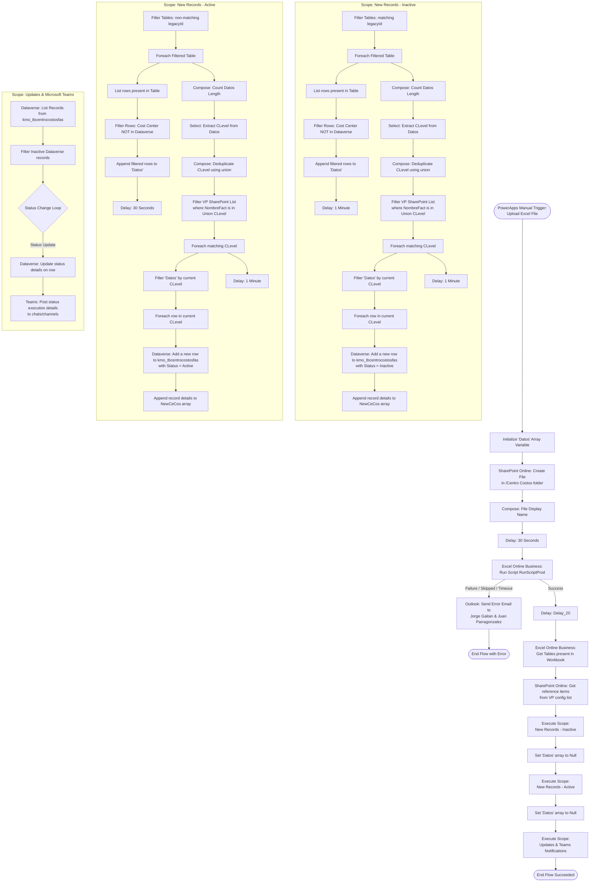

# Power Automate Flow Documentation: Dataverse - CeCosImport

This document provides a technical walkthrough and a functional flowchart of the **"Dataverse - CeCosImport"** [Passage 1, 76] automated flow. This flow is designed to ingest Cost Center (Centro Costos) Excel files uploaded from Billing (Facturación), run formatting/validation scripts, process new cost center records into Microsoft Dataverse with Active/Inactive statuses, update status histories, and dispatch status alerts to Microsoft Teams and Outlook [Passage 1, 2, 76, 77].

---

## 1. Flow Overview & System Architecture

The automation orchestrates integration across five key platform connectors:
*   **Power Apps (Trigger)**: Initiates the process when a user manually triggers the flow and uploads a file [Passage 1, 76].
*   **SharePoint Online**: Acts as the document repository and holds VP configuration reference lists [Passage 1, 2, 76, 77].
*   **Excel Online (Business)**: Hosts the uploaded workbook where table schemas are inspected and an Office Script is run [Passage 1, 2, 76, 77].
*   **Microsoft Dataverse**: Serves as the master database for cost center records (`kmo_tbcentrocostosfas` entity) [Passage 3, 78].
*   **Office 365 Outlook & Microsoft Teams**: Handle error reporting (Outlook) and operational/completion notifications (Teams) [Passage 2, 75, 77].

---

## 2. Technical Flowchart (Mermaid)

The flowchart below outlines the end-to-end execution of the flow, highlighting branching logic for success/failure routes, loops, and conditional statuses.

---

## 3. Trigger and Initial Steps

1.  **Manual PowerAppV2 Trigger**:
    *   **Description**: The flow is manually started from a Power Apps application [Passage 1, 76].
    *   **Required Parameter**: `file` object (contains `name` as string and `contentBytes` formatted as byte) [Passage 1, 76].
2.  **Initialize Array Variables**:
    *   `Initialize_variable_-_Datos`: Creates a global array variable called `Datos` to store cost center items during filtering phases [Passage 1, 76].
3.  **Create File in SharePoint**:
    *   **Action**: `Create_file` via the SharePoint connector [Passage 1, 76].
    *   **Site Address**: `https://teleperformance.sharepoint.com/sites/ProcessAutomation` [Passage 1, 76].
    *   **Folder Path**: `/Centro Costos` [Passage 1, 76].
    *   **Output Name & Body**: Uses the dynamic outputs from the trigger (`triggerBody()['file']['name']` and `triggerBody()['file']['contentBytes']`) [Passage 1, 76].
4.  **Extract Display Name & Wait**:
    *   `Compose_-_DisplayName`: Extracts the file display name [Passage 1, 76].
    *   `Delay_21`: Introduces a **30-second wait** to ensure file writing is completely finalized on the SharePoint server [Passage 7, 82].

---

## 4. Office Script Execution & Critical Error Handling

1.  **Run Office Script**:
    *   **Action**: `Run_script` on Excel Online (Business) [Passage 1, 76].
    *   **Target File**: Uses SharePoint File ID `@outputs('Create_file')?['body/Id']` [Passage 1, 76].
    *   **Script Identifier**: Runs an Office Script with ID `ms-officescript%3A%2F%2Fonedrive_business_itemlink%2F01ZYDY5Z5ZIN6HFVYEING2G7SPMGWK5UR4` [Passage 1, 76].
2.  **Error Handling (Run Script Fails/Times Out)**:
    *   **Scope**: Configured with `runAfter` equal to `Failed`, `Skipped`, or `TimedOut` on `Run_script` [Passage 2, 77].
    *   **Action**: `Send_an_email_(V2)` (Office 365 Outlook) [Passage 2, 77].
    *   **Recipients**: `Jorge.GaitanRealpe@teleperformance.com;juan.parragonzalez@tp.com` [Passage 2, 77].
    *   **Subject**: "Fallo Cento Costos - Excel Script" [Passage 2, 77].
    *   **Body**: "Hola Juan Camilo, Ha fallado el flujo al cargar el Script, frente al documento cargado por Facturación @{utcNow()}" [Passage 2, 77].
    *   **Importance**: Normal [Passage 2, 77].

---

## 5. Success Path & Core Business Logic

If the Excel Script runs successfully:
1.  `Delay_20` is completed, then the flow calls `Get_tables` to obtain all Excel tables [Passage 2, 77].
2.  The flow calls `Get_items_-_VP` on SharePoint to load master organization structures from list `fbfc61e7-98bd-49ab-b34c-f6ead7a8bccf` [Passage 2, 77].
3.  The flow bifurcates logic into two main processing blocks to handle **Inactive** and **Active** records sequentially [Passage 2, 5, 77, 80]:

### Block A: Processing Inactive New Records
*   **Filter Tables**: Evaluates `Get_tables` and keeps tables matching a specific `legacyId` [Passage 2, 77].
*   **Apply to Each Table**:
    1.  `List_rows_present_in_a_table - Name`: Extracts rows from the current table [Passage 2, 77].
    2.  `Filter_array_-_CostCenter`: Retains rows where the **Cost Center** field does *not* exist in the existing Dataverse list (`Select_-_NewCostCenter`) [Passage 3, 78].
    3.  `Append_to_array_variable_-_Datos`: Collects remaining new cost centers into the `Datos` array variable [Passage 3, 78].
    4.  `Delay_2`: Introduces a **1-minute wait** per table [Passage 3, 78].
*   **Map C-Level & reference with SharePoint**:
    1.  Deduplicates C-Level values from the array using a `union` function: `@union(body('Select_-_CLevel'), body('Select_-_CLevel'))` [Passage 3, 78].
    2.  `Filter_array_-_CLevel`: Filters the VP reference list where `NombreFact` is present in the deduplicated C-Level array [Passage 3, 78].
*   **Bulk Ingestion**: For each C-Level match, it queries `Datos` and executes `Add_a_new_row` (Dataverse) [Passage 3, 78]:
    *   Adds rows with **`kmo_status` = "Inactive"** [Passage 3, 78].
    *   Appends metadata to the `NewCeCos` array [Passage 4, 79].
*   **Cleanup**: Calls `Set_variable_-_Datos_null` to clear the variable and free memory [Passage 4, 79].

### Block B: Processing Active New Records
*   **Filter Tables**: Evaluates tables where `legacyId` does *not* match [Passage 5, 80].
*   **Logical Execution**: Mirror process to Block A, but executes Dataverse inserts with **`kmo_status` = "Active"** [Passage 6, 81].
*   **Cleanup**: Calls `Set_variable_-_Datos_null_2` to clear the variable [Passage 6, 81].

---

## 6. Dataverse Mapping Specifications

New cost center rows created in the Dataverse table `kmo_tbcentrocostosfas` are mapped from Excel and SharePoint source fields as follows [Passage 3, 78]:

| Target Dataverse Field | Source Column / Expression | Description |
| :--- | :--- | :--- |
| **`kmo_cleveld365`** | `CLevel` | Organization C-Level Identifier |
| **`kmo_client`** | `ClientName` | Name of the assigned Client |
| **`kmo_company`** | `Company` | Parent Company ID |
| **`kmo_correoa`** | `Correo` | Owner's email (from VP reference list) |
| **`kmo_market`** | `Market` | Region or market segment |
| **`kmo_name`** | `Description` | Cost Center description name |
| **`kmo_newcostcenter`**| `Cost Center` | Newly generated Cost Center code |
| **`kmo_nombrea`** | `NombreSQL` | Registered SQL Name of the Cost Center |
| **`kmo_nta`** | `NT` | Network identifier (from VP reference list) |
| **`kmo_oldcostcenter`**| `@if(empty(...), 0, ...)` | Old Cost Center code (defaults to 0 if null) |
| **`kmo_ownera`** | `BMSID` | Owner's internal BMS ID (from VP reference list) |
| **`kmo_status`** | `"Inactive"` OR `"Active"` | Conditional status depending on Scope block |

---

## 7. Updates and Microsoft Teams Alerts

At the end of processing, the flow enters the **`Updates`** scope [Passage 6, 81]:
1.  **Retrieve Current Records**: Executes `List_rows_2` from Dataverse table `kmo_tbcentrocostosfas` [Passage 6, 81].
2.  **Evaluate Inactive Transitions**: Filters listed rows where the current status contains "Inactive" to evaluate potential active-to-inactive state changes (`ActiveToInactive`) [Passage 7, 82].
3.  **Post Process Status Messages to Teams**:
    *   **Channel Post**: Publishes updates to Teams channel `19:s0ZbDB5AVulApN5uj9hJKGMeXozEhs4hIT_wKss9ya01@thread.tacv2` (GroupID: `e6982754-1cd1-4628-b5a9-95e63e7d7b95`) [Passage 73, 75].
    *   **Direct Chat Alerts**: Posts details to specific group chat `19:33e4b4ca8d6447b781faf6fa1853d38d@thread.v2` [Passage 73, 75].
    *   **Iterative Notifications**: Loops through dynamic success (`Apply_to_each_Complete`) and failure (`Apply_to_each_Fallos`) recipients to post customized process summaries directly via Teams chat bot [Passage 73, 75].
